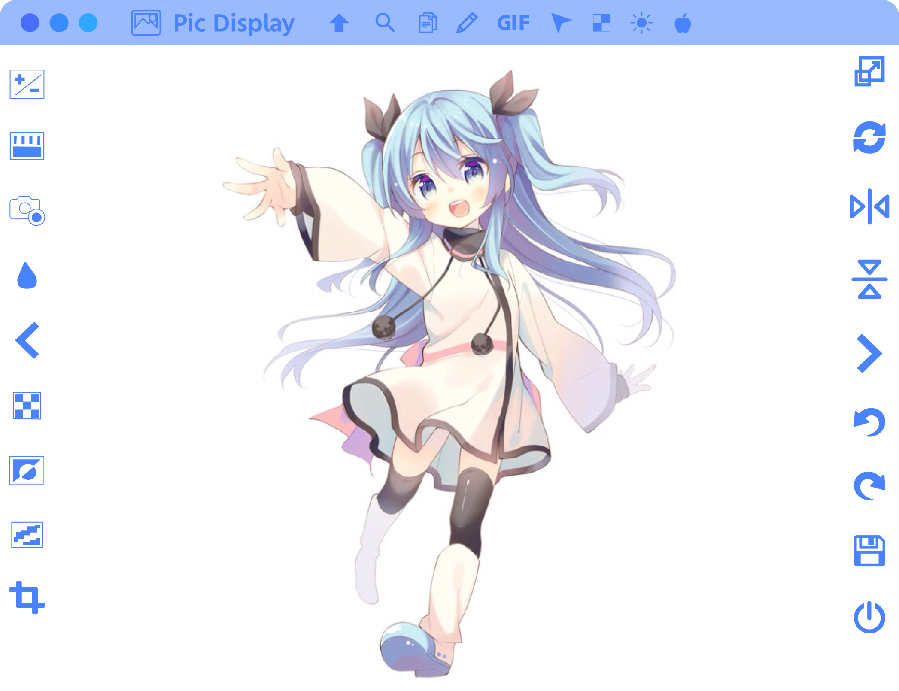

## Pic Display

A cute image viewer!

### Features:
- View images (PNG, JPG, WEBP, AVIF) and animated GIFs
- Support for remote links and images on the clipboard
- Brightness/Contrast adjustment
- Hue/Saturation/Lightness adjustment
- Tint adjustment
- Blur and Sharpen effects
- Pixelate effect
- Binarize effect
- Crop images with a cropping tool
- Annotate images with a pen and eraser
- Resize, rotate, and flip transformations
- GIF speed, reverse, and transparency adjustments
- Undo and redo history states
- Save images and GIFs with applied effects
- Process multiple images in bulk

### Keyboard Shortcuts:
- R: Rotate
- T: Toggle transparency
- Q: Decrease brush size
- W: Increase brush size
- B: Toggle brush
- E: Toggle eraser
- Space: Pan over cropping area
- Escape: Reset rotation
- Double Click: Reset rotation, zoom, and pan
- Ctrl Z: Undo
- Ctrl Shift Z: Redo
- Ctrl +: Zoom in
- Ctrl -: Zoom out
- Ctrl C: Copy
- Ctrl V: Paste
- Ctrl S: Save image(s)
- Ctrl O: Open image(s)
- Drag and drop: Open image(s)

### Design

Our design is available here: https://www.figma.com/design/kqGaBzYxe93zSPxDPz6wRa/Pic-Display

### Installation

Download from [releases](https://github.com/Moebytes/Pic-Display/releases).

### See Also

- [Tune Player](https://github.com/Moebytes/Tune-Player)
- [Frame Player](https://github.com/Moebytes/Frame-Player)

